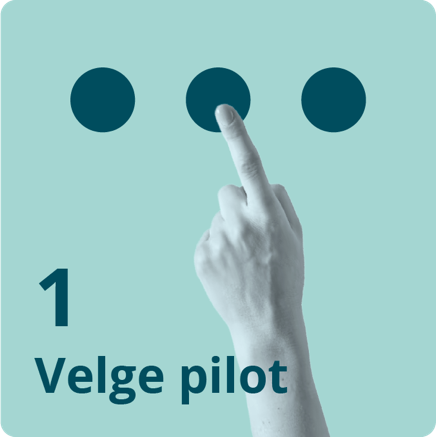
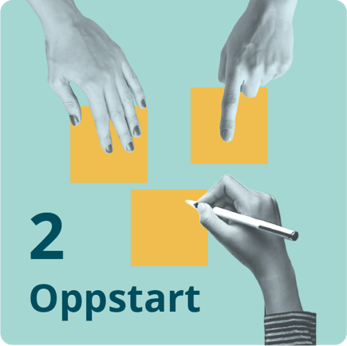
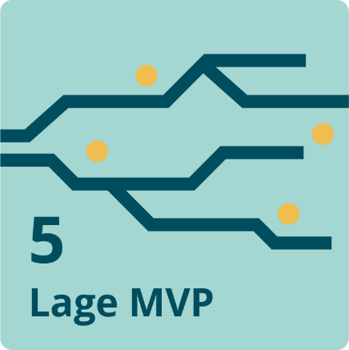
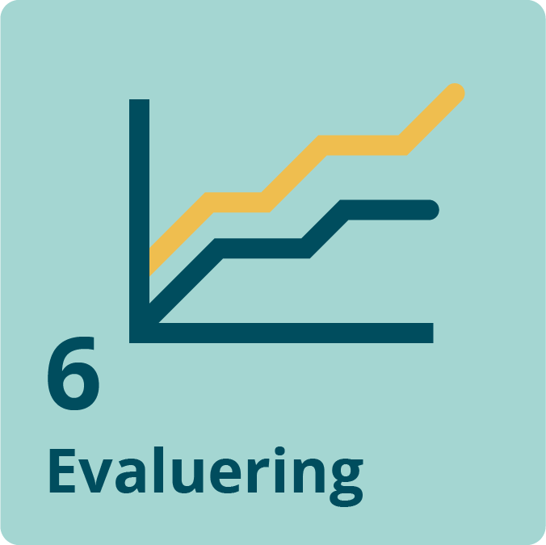

Erfaringer fra 1. pilot (Versjon 0.1 – 23.02.2026). Danner grunnlag for løpende oppdatering av håndboken for gjennomføring av piloter.

## Innledning

Formålet med SAMT-BU er å etablere et felles fundament for samarbeid og kunnskap om datadrett tjenesteutvikling og sømløse brukerreiser på tvers av forvaltningsnivåer og sektorer, med pilotering ut fra området barn og unge – fra barnehage til høyere utdanning. Gjennom praktisk utprøving og kompetansebygging skal prosjektet legge grunnlag for at felles fundamentet er modent og kjent, slik at det blir brukt og bygget videre på, også på andre områder.

Et av prosjektets mest sentrale produkter er å levere MVP-er/POC-er og pilotering av informasjonsmodeller og tjenester. Prosjektet ønsker også å ha en smidig tilnærming til oppgavene basert på nysgjerrighet og læring gjennom utprøving i korte iterasjoner, slik at vi raskt kan vise reell verdi og også raskt finner ut hva som ikke fungerer (fail fast). Vi vil gjøre dette gjennom pilotprosjekter som dekker prioriterte use cases.

Prosjektet har utarbeidet en egen «håndbok» for gjennomføring av piloter som vil bli løpende oppdatert etterhvert som man høster erfaring med gjennomføringen. Dette dokumentet inneholder erfaringer fra 1. pilot og vil danne grunnlag for oppdatering av håndboka.

## Velge Pilot

Valg av pilot er egentlig ikke en del av prosessen for gjennomføring av pilot, men en forutsetning for oppstart.

- Grunnlagene for valg av pilot kunne vært bedre og bør detaljeres ytterligere. Painpoints bør identifiseres.
- Piloten bør velges i god tid før oppstart.
- Det er stort sprik i oppfatningen av hva som er et problem og hva som ikke er et problem. Det bør etableres felles virkelighetsforståelse tidlig.
- Kommune- og fylkesrepresentanter bør inn i ressursgruppa.
- Klarere mål for piloten.

## Oppstart

Målet med oppstartsfasen er å rigge teamet som skal jobbe med piloten og å sette rammer og mål for arbeidet.

- Det var for kort tid mellom valgt pilot og plan-ws.
- Det var for kort tid mellom plan-ws og faktisk oppstart, utfordrende å få riktige ressurser med.
- Gevinstpotensialet i piloten var ikke tydelig nok.
- Drømmereiser tar lenger tid å lage.
- Det er stort sprik i oppfatningen av hva som er et problem og hva som ikke er et problem.
- Det er ulike meninger om «hvorfor» og «hva», som skal være leveransen fra piloten (POC). Fokus på læring eller levere kjørbar tjeneste.

## Drømmereisen

Det er viktig at pilotene bidrar til oppfyllelsen av visjonen om sømløse brukerreiser på tvers av forvaltningsnivåer og sektorer. For å ha et utgangspunkt å strekke seg etter, vil prosjektet først fokusere på en perfekt brukerreise i en perfekt verden der alle hindringer er ryddet av veien. Vi kaller dette en drømmereise.

- Drømmereiser tar lenger tid å lage.
- Det er stort sprik i oppfatningen av hva som er et problem og hva som ikke er et problem (bra at det ble avdekket).

## Velge MVP/Prototype/POC

Det er sjeldent aktuelt å realisere hele Drømmereisen umiddelbart, og prosjektet må velge hvilken del man ønsker å sette søkelys på først.

- Uklarheter om vi skulle lage POC eller MVP.
- Det var for dårlig forankret at vi kjørte POC hos KS-Digital.

## Lage det

Enten det som skal lages er en faktisk løsning som skal kjøre eller en teoretisk modell, vil utviklingsprosessen følge de smidige prinsippene.

- 2-ukers-sprinter med høyt tempo funker.
- Vi bør ha en person som «holder i» piloten, aka en delprosjektleder.
- Problemer med å finne folk som kan gjennomføre OKR-ws.
- Problemer med å finne folk som kan gjennomføre ROS.

## Evaluering

Med jevn oppfølging av OKR vil man ha en god formening om hvordan gjennomføringen har gått, når man nærmer seg slutten av piloten.

- Det er vanskelig å få data ut fra fagsystemene til kommunen, til tross for at det er nedfelt i konkurransedokumenter, ref. erfaringene fra Bergen.
- Systemleverandørene tar betalt per kommune for å få ut data. Selv om det ikke koster all verden for en enkelt kommune, blir totalsummen mangfoldige millioner landet sett under ett.

## Fortelle omverden om det vi har gjort

Det er identifisert som en kritisk suksessfaktor at SAMT-BU lykkes med å engasjere interessentene i prosjektet slik at de tar løsninger og kunnskap i bruk så fort det foreligger. Kommunikasjon er derfor et nøkkelbegrep og bør være et hovedfokus gjennom hele piloten.

- Vi er for dårlige på kommunikasjon.

## Generell prosjektgjennomføring/samarbeid

- Det er vanskelig å få kommunikasjonsverktøy og dokumenthåndtering til å fungere på tvers av organisasjoner. F.eks. Teams.
- Struktur for «oppbevaring» ble ganske kaotisk.
- Alle sentrale parter bør være med i kjernegruppa – både for kapasitet, eierskap og håndtering av uenigheter.
- Økonomioppfølging og timeføring. Spesielt forståelse av hvordan MedFins regler er.
- Må få samarbeidspartnerne til å forstå viktigheten av å føre timer.
